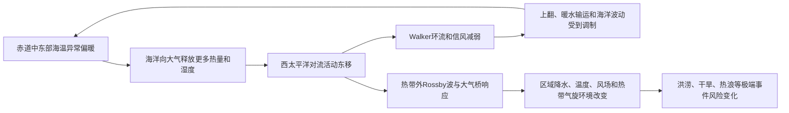

## 执行摘要：2026年事件风险显著上升，但决策必须落实到区域、季节与承灾体

截至2026年9月8日，可核验信息显示，WMO于2026年9月3日发布通报，确认热带太平洋厄尔尼诺事件已经形成，预计将在未来数月增强，可能在年底前后达到峰值；事件持续至2027年2月的概率“极高、接近100%”。WMO同时警告，强事件将提高洪涝、干旱和极端高温风险，但**事件强度不能单独决定某一国家或地区的具体灾情**。中国业务监测显示，2026年8月Niño 3.4相关指数为2.59℃，按GB/T 33666—2017的峰值分级口径已进入“超强”阈值区间；但最终等级仍应以事件完整峰值认定为准，不能仅凭单月数值或媒体表述认定为“有记录以来最强”。[1][2]

厄尔尼诺不是一次暴雨、一场高温或一次台风的直接“元凶”，而是热带太平洋海温异常与沃克环流、Hadley环流及全球遥相关耦合形成的年际气候信号。它通过改变大气热力结构和环流异常，调整不同地区发生极端事件的概率。实际灾情还受到印度洋、大西洋、西北太平洋、区域地形、城市暴露度、生态系统和社会脆弱性共同调制。全球变暖并未使厄尔尼诺的简单“强弱”结论获得高信度确认，但更暖的背景海洋和大气会提高热浪、暖夜、蒸发及复合型灾害的发生概率。[3][8]

因此，决策重点不应停留在为一次ENSO命名，而应建立完整的风险链条：**ENSO监测预测—季节性风险图谱—影响驱动预报—提前行动—灾中生命救援—灾后包容性恢复**。预警系统、预置物资、水资源调度、农业保险、公共卫生监测和生命线韧性，均已有成熟框架。真正造成差异的不是发布多少预警，而是预警能否触发支付、停工、转移、泄洪、播种调整和医疗前置等可审计行动。[4]

本报告仅用于防灾、减灾、应急、恢复与气候适应，不研究、不讨论任何人为制造、改变、操控或武器化ENSO及天气灾害的方法、方案、可行性或思路。

## 一、关键说法核查：强事件预警可信，但“峰值、持续时间与区域灾情”仍须区分时态

**WMO的高概率判断针对事件持续状态，而不是对单一灾害的精确预报。** 2026年9月3日WMO《厄尔尼诺/拉尼娜通报》的权威转引显示，受热带太平洋异常暖海温推动，厄尔尼诺预计将继续增强，并可能在2026年底达到峰值；其持续至2027年2月的概率接近100%。WMO秘书长绍洛要求各国密切监测并作出“超常准备和响应”。这一表述与ENSO通常在北半球冬季前后达到峰值的季节锁相特征一致。[1]

| 视频或媒体说法 | 核验结论 | 应采用的规范表述 |
|---|---|---|
| “超强厄尔尼诺已形成” | **部分成立，须注明分级口径** | 可称“预计发展为非常强或超强事件”；按中国标准，事件峰值Niño 3.4 3个月滑动距平≥2.5℃才为超强。单月或周异常不能直接替代峰值认定。 |
| “持续至2027年2月可能性接近100%” | **基本准确，但应保留时态和对象** | WMO判断的是ENSO状态持续到2027年2月的概率，不是某国暴雨或干旱持续至该时点。 |
| “世界已进入危险区” | **属于风险警示，不是可测量指标** | 可作为政策动员语言引用，但不应推导为所有地区风险同步上升。 |
| “2026年事件已是有记录以来最强” | **证据尚不充分** | 可以表述为“发展速度快、部分指标异常显著，能否超过1997/98、2015/16仍有待峰值确认”。 |
| “厄尔尼诺导致某地某次极端天气” | **因果关系过度简化** | 应改为“ENSO改变了该区域极端事件的条件概率或风险背景”。 |

**中国标准能够提供明确的强度语言，但不能替代跨国比较。** GB/T 33666—2017以Niño 3.4指数3个月滑动平均绝对值达到或超过0.5℃、且持续至少5个月作为事件判据；峰值强度绝对值在0.5—<1.3℃为弱，1.3—<2.0℃为中等，2.0—<2.5℃为强，≥2.5℃为超强。国家气候中心相关监测于2026年9月转引显示，7月指数为2.09℃、8月为2.59℃，均为1951年以来历史同期高值，并预计11—12月前后达到峰值。[2]

*图1：中国标准中的ENSO强度分级阈值，以及2026年8月Niño 3.4相关监测指数。图中“2026年8月监测指数”是月度监测值，不能提前替代完整事件峰值。数据来源：GB/T 33666—2017；国家气候中心监测信息[2]。*

**历史比较必须区分三类数据：事件强度、单点海温与全球气候异常。** 1982/83、1997/98和2015/16通常被列为20世纪50年代以来最强的暖ENSO事件。2015/16事件叠加长期增暖背景，对全球温度、干旱、洪水、粮食和卫生系统产生广泛冲击；1997/98则造成秘鲁—厄瓜多尔沿岸洪涝和泥石流、东南亚干旱与林火、美国南部洪涝等重大灾害。[3][5][6]

但不同机构采用的海洋数据集、平滑方式、区域定义和峰值月份并不完全一致。跨机构比较只能使用统一指标，不能把周、月、季尺度上的异常值混合排序。对2026年最稳妥的判断是：**事件风险已经达到需要启动最高级别准备的程度，但最终历史排名仍须等待完整峰值确认。**

强度分级和监测数据下载（原始数据文件未随本站发布，详见文末数据来源 [2]）

## 二、ENSO机制：异常不是停留在赤道太平洋，而是通过海气耦合重塑全球环流

**ENSO的核心是海洋热力学异常与大气环流异常的相互作用。** 正常年份，东南信风将赤道表层暖水向西输送，使西太平洋暖池增厚、东太平洋存在上升流，并形成赤道太平洋海面高度和海温的纬向梯度。这一梯度支持低层风从东向西流动，同时驱动Walker环流：西太平洋对流活跃并伴随上升运动，东太平洋下沉气流相对偏强。

厄尔尼诺发生时，赤道中东部海温持续偏暖，海洋向大气输送更多热量和 moisture，西太平洋对流活动东移，赤道太平洋的纬向海温梯度减弱。由此，Walker环流的上升支东移，东太平洋下沉运动受到抑制，贸易风进一步减弱。表面风减弱还会减少东太平洋上翻和向西输运，并通过海洋波动和反馈过程使暖异常持续。若这一过程在合适季节形成有效反馈，海气耦合便可能持续数月；反之，短暂暖脉冲未必能够发展为完整事件。[8]

**Niño 3.4是监测指标，不是海洋物理现象本身。** 该区域通常指赤道太平洋5°S—5°N、170°W—120°W。NOAA的海洋尼诺指数（ONI）采用Niño 3.4海温异常的3个月滑动平均；中国标准同样以Niño 3.4指数作为事件判识、强度、持续时间和峰值的基础指标。采用3个月滑动平均的目的，是平滑周际噪声并检验异常的持续性，因此不能把某一天或某一周的极高值直接称为“超强事件”。[2]

**暖ENSO通常经历“启动—发展—成熟—衰减”，但事件类型会显著改变区域响应。** 事件往往在春夏季启动，在北半球晚秋至冬季达到成熟峰值，随后在春季衰减，周期通常为2—7年，但这不是严格时钟。除传统东部型暖事件外，暖异常中心偏于中太平洋的“中部型”或“Modoki”事件，对西北太平洋副热带高压、台风生成环境、东亚季风和北美降水的影响，可能不同于经典东部型。

中国业务标准同时保留东部型和中部型判识，原因正在于同一Niño 3.4数值未必对应相同的区域影响。[2] 这意味着，风险预测不能只写“厄尔尼诺年”，而应同时给出暖中心位置、季节、衰减阶段及印度洋—大西洋条件。

**ENSO只有经过遥相关，才会转化为区域天气风险。** 热带太平洋加热异常可激发大气Kelvin波、Rossby波和纬向环状模等响应，并经由“大气桥”影响中高纬涡旋、急流位置和季风系统。典型响应包括：

| 区域 | 暖ENSO背景下常见的风险倾向 | 决策边界 |
|---|---|---|
| 秘鲁、厄瓜多尔、智利北部 | 沿岸降雨和洪涝风险上升 | 仍受局地对流、地形和季节过程控制 |
| 巴西南部、阿根廷、乌拉圭及拉普拉塔盆地 | 湿期风险增加 |
| 中美洲、加勒比、南美洲北部、南部非洲、澳大利亚、印度尼西亚、菲律宾 | 部分区域干旱或火灾风险增加 |
| 东亚—西北太平洋 | 夏季风、梅雨雨带、西北太平洋台风活动和冬季风均可能受到调制 | 不能依据事件强度直接断言“南方一定涝、北方一定旱” |

2015—2016年，非洲之角部分地区的洪水与干旱风险、南半球的农业冲击，以及东南亚干旱和林火风险，均说明ENSO可通过区域气候、水资源、农业和生态条件形成不同灾种。OCHA在2015年针对索马里预置船只和物资、清理排水系统，正是将季节性风险转化为提前行动的典型案例。[6]

## 三、气候变暖叠加：背景风险升高，不等于厄尔尼诺本身必然增强

**长期增暖会抬高热浪、暖夜和蒸散的背景基线，ENSO在此基础上进一步扰动降水与环流。** IPCC指出，人类活动已经使大气、海洋和陆地变暖，并增加了极端高温、部分极端降水、干旱和热带气旋相关风险的证据。WMO在2026年通报背景下也强调，异常暖海温和更暖大气可使部分极端影响放大。[1][3]

因此，“厄尔尼诺叠加全球变暖”不能理解为两者风险简单相加。更准确的理解是：长期趋势抬高了高温、暖夜、蒸发和海平面等背景基线；ENSO再通过海温距平和环流异常改变空间格局，使部分区域出现热浪、洪涝、干旱或作物减产的概率上升。

**“超强事件越来越频繁”目前仍不是确定性结论。** IPCC对CMIP6多模式评估显示，ENSO降雨变率在21世纪后半叶增强的可能性较大，但以海温表征的ENSO强度如何变化仍存在较大不确定性。[3] 这一区分十分关键：

- 即使暖池与对流响应保持不变，更暖的大气也可能使降水响应更强；
- 即使ENSO海温振幅不变，长期变暖仍可能提高热浪和复合干旱的风险；
- 即使ENSO最终强度不变，印度洋、大西洋及背景海温变化也可能改变区域遥相关。

预案因此不能只围绕“Niño 3.4是否超过2.5℃”运行，而应滚动评估海温异常、大气耦合、印度洋—大西洋条件、季风和区域极端风险。

**单次极端天气事件不能仅凭发生年份就归因于ENSO。** 归因研究应区分不同尺度：ENSO是季节至年际尺度的概率信号，暴雨、台风和高温则受到天气尺度系统、局地下垫面、城市热岛、前期土壤湿度、海洋热含量和人为排放共同影响。严谨表述应为：“在给定季节和区域，强厄尔尼诺使某类极端事件的风险升高”，不能表述为“厄尔尼诺造成了这次具体暴雨”。

对于城市内涝，决定损失大小的关键还包括排水设计标准、管网维护、河道行洪、地下空间挡水和预警响应；对于高温，关键还包括夜间降温条件、供电能力、户外劳动保护和脆弱人群可及性。海洋信号只提供风险背景，暴露度和脆弱性才决定最终损失。

## 四、对中国的影响路径：风险取决于季节、事件类型与下游环流配置

**厄尔尼诺对中国最重要的价值，是把大范围气候概率转化为分区、分时、分行业的决策边界。** 暖ENSO可通过西北太平洋海温、对流和风场异常影响西太平洋副热带高压的位置与强度，进而影响东亚夏季风、梅雨锋面和台风路径环境。冬季则可能通过热带加热、遥相关和欧亚雪冰—反照率等过程调制东亚冬季风，但后者的可预测性和机制置信度低于热带海气耦合，不能机械外推为“厄尔尼诺年一定冷冬”。

**夏季风险的核心不是固定雨带，而是雨带摆动、台风活动与前期水汽条件的组合。** 国家气候中心相关监测指出，2026年夏季我国东部呈现南北两条多雨带，暴雨面广、落区重叠，台风登陆偏多；但这一实况不能被反推为所有暖事件的必然结果。[7] 预案应把下列情形纳入情景集：

| 风险单元 | 需要评估的关键变量 | 典型决策问题 |
|---|---|---|
| 江淮、江南及华南 | 梅雨锋面、季风涌、台风倒槽、副热带高压位置 | 是否需要提前调度水库、预降河道水位、加固地下空间 |
| 华北、东北及西南 | 水汽输送、锋面、地形抬升和局地对流 | 是否需要针对阶段性强降水和山洪地质风险转移人员 |
| 西北及江南部分区域 | 高温、蒸散、土壤湿度和水资源约束 | 是否需要调整灌溉、能源保供和户外劳动安排 |
| 登陆及近海区域 | 台风生成环境、路径、强度和风雨重叠 | 是否需要提前避险、停运和转移沿海设施 |

**秋冬季准备必须覆盖滞后影响。** 即使ENSO在2027年初衰减，前期海温异常、印度洋条件、土壤湿度和大气环流记忆仍可能影响后续季节。WMO关于2026年事件持续至2027年2月的判断，意味着农业、水资源、卫生和应急部门至少应覆盖跨年度预算、库存和恢复周期，而不是在冬季结束后立即退出应急状态。[1]

**跨部门情景不应停留在“旱或涝”的二分法。** 建议国家、流域和城市层面分别运行四组情景：

1. **典型东部型强暖事件**：重点检验华南前汛期、江淮梅雨、华北—东北夏季强降水、台风重叠及秋冬旱涝转换。
2. **中部型暖事件**：重点检验西北太平洋台风环境、副热带高压异常及南方高温风险。
3. **暖事件叠加IOD正位相或印度洋偏暖**：重点检验西南水汽输送、南方降水和干旱空间型的变化。
4. **暖事件叠加拉尼娜快速衰退或中性背景**：重点检验预报转折期误判和跨季节衔接风险。

每组情景都应明确触发指标、责任部门、资产清单、转移阈值和行动时限，使ENSO预报真正进入财政、农业和应急流程。

## 五、监测预测与预警体系：预报技巧必须以“触发行动”重新设计

**国际体系已经具备多中心交叉验证框架，地方行动才是最终产品。** WMO《厄尔尼诺/拉尼娜通报》由全球长期预报制作中心、各国国家气象水文部门及专家意见综合形成，并与国际气候与社会研究所（IRI）合作，为全球政府、人道机构和气候敏感行业提供决策信息。常用业务链条包括热带太平洋观测、同化再分析、统计与动力模式集合预报、专家会商和概率发布。[1]

主要机构及职能可概括如下：

| 层级 | 机构 | 核心职能 |
|---|---|---|
| 全球 | WMO、IRI | 组织全球监测、模式比较、会商及趋势通报 |
| 全球 | IPCC | 评估长期变化、归因和情景 |
| 国家 | 中国气象局、国家气候中心 | ENSO监测、季节预测、国家标准应用 |
| 国家 | 美国NOAA/CPC、澳大利亚BOM、日本JMA | 区域监测、预报和业务预警 |
| 地方 | 流域机构、城市气象水文部门 | 将大尺度概率转化为具体阈值和行动 |

**季节预报的正确用法是概率风险规划，而不是把月份、地点和强度写成确定日程。** ENSO季节预测通常对未来数月海温异常方向具有一定技巧，但峰值时点、空间型、大气耦合速度和区域降水细节仍存在误差。IPCC指出，多模式通常优于单一模式，但多年至十年尺度降水的预测技巧总体低于温度，撒哈拉以南地区因北大西洋海温遥相关相对例外。[8]

因此，预报产品应至少提供以下内容：

- 事件状态及峰值区间；
- 关键月份的概率分布；
- 区域降水和温度概率；
- 不确定性与模式分歧；
- 与IOD、AMO等其他驱动因子的相互作用；
- 可触发的部门行动。

如果预报产品只有一张“偏多或偏少”的地图，却未定义转移、停工、调度和采购阈值，就不能形成有效预警。

**“全民早期预警”必须从发布信息升级为完整行动周期。** WMO/UN“全民早期预警（Early Warnings for All）”计划的目标是在2023—2027年让全球人人获得极端危险天气预警。其四大支柱包括灾害风险知识与风险管理、观测与预报、预警发布与传播、备灾与响应；UNDRR、WMO、ITU和红十字会与红新月会国际联合会分别牵头相关工作。相关材料指出，预警可挽救生命并提供至少10倍的投资回报，但目前全球仅约一半国家建立预警系统，完整预警周期的覆盖仍有限。[4]

**基于影响的预报应覆盖“人是谁、何时行动、成本由谁承担”。** 传统预报回答“降多少毫米”，影响预报则回答“哪段河流可能漫堤、哪些社区需要转移、何时断电、哪类作物需要改种”。建议中国建立ENSO季节风险产品模板：

| 产品 | 必备内容 |
|---|---|
| 国家季节展望 | 分区温度、降水概率及主要遥相关 |
| 流域水文风险产品 | 土壤湿度、径流、库容和防洪限制水位 |
| 城市内涝风险产品 | 地下空间、下穿道路、医院和交通节点阈值 |
| 农业产品 | 关键生育期、干旱天数、病虫害和收获窗口 |
| 公共卫生产品 | 高温暴露、媒介疾病、饮水卫生和营养风险 |
| 能源产品 | 高峰负荷、水电来水、输电风险和燃料调度 |
| 行动页 | 阈值、时限、责任主体、资源授权和降级条件 |

每类产品必须设置“预警—确认—授权—执行—核验”闭环。否则，预报虽然正确，行动仍可能迟滞。

## 六、预防与韧性建设：提前数月行动，比灾后集中救援更具成本效益

**风险图谱应把气候概率、暴露度和脆弱性放在同一张决策底图上。** 气候概率由季节预测和ENSO驱动提供；暴露度包括人口、农田、水库、能源设施、港口、通信和供应链；脆弱性则包括贫困、年龄、残障、居住稳定性、医疗保障和治理能力。三者相乘后，同一降雨异常可能形成完全不同的损失。

部门风险图至少应覆盖以下要素：

- 山洪和地质灾害隐患点；
- 河流、水库、蓄滞洪区及城市内涝点；
- 地下水、水库、灌区和地下水超采区；
- 粮食主产区、畜牧区、渔港和冷链节点；
- 医院、学校、养老院和临时安置点；
- 电网、通信、交通和应急物资节点；
- 传染病媒介分布和饮水卫生薄弱区域。

**水资源管理的优先顺序应是提高系统弹性，而不是依赖单次预测。** 暖ENSO年份同时可能出现“多雨区洪涝”与“少雨区干旱”，因此水库调度不能只看本地降水异常，还需开展流域联合调度。具体措施包括：

- 建立丰枯并存、跨区调度的弹性方案；
- 维护蓄滞洪区、分洪通道和生态滞蓄空间；
- 将水质风险纳入洪水调度；
- 完善地下水回补和非常规水利用；
- 在干旱区推广耐旱品种、节水灌溉和播期调整；
- 在湿润区预留削峰库容和行泄通道。

2026年这类强信号年份，适合把弹性调度从年度计划升级为滚动90天方案，并至少设置一次极端情景演练。

**城市排水的关键不是只提高重现期参数，而是提高系统可操作性和冗余度。** 应建立“预报降雨—管网能力—河网水位—泵站电源—地下空间挡水—转移路线”联动模型。对下穿立交、地铁、地下车库、隧道和地下商业体，应在暴雨预警前完成封控准备、移动泵车和人员转移；医院、养老院和通信机房则应配置防水、供电冗余和应急供水中转。

深圳、广州、郑州、北京、上海等城市已有不同类型极端降雨经验，但这些经验不能直接复制。每个城市都必须根据自身地形、管网、河湖关系、人口流动和夜间预警可达性重新校准。

**农业和粮食系统应把风险管理前移至播种期。** 农业、气象、水利和粮食储备部门可联合发布播种窗口、耐逆品种、灌溉定额、病虫害和收获期建议；同步使用天气指数保险、收入保险、期货套保和应急储备，对冲减产与价格波动。2015/16年事件曾使数百万人的健康与粮食不安全风险受到关注，说明农业风险不能只在收获后才进入人道系统。[5]

需注意，保险只有在触发、核损、支付和再保险安排清晰的条件下，才能转化为有效的事前激励。否则，它只是灾后损失分摊工具，而非提前行动机制。

**公共卫生必须针对暖ENSO的复合风险进行前置部署。** 相关风险包括洪水后的腹泻病、霍乱样疾病和蚊媒疾病，干旱与高温条件下的营养不良、饮水困难和热相关疾病，以及森林火灾带来的空气污染。WHO/WMO曾提醒，强ENSO可加剧粮食不安全、营养不良、传染病、林火和水资源短缺；疟疾、裂谷热等风险与区域气候和环境条件存在关联。[5]

应对措施包括强化疾病 sentinel 监测、饮水与环境消杀、蚊媒控制、孕产妇和慢病患者服务，以及针对流离失所人群的免疫和医疗转运。预警中的脆弱人群不能只用行政名单识别，还应结合夜间高温、无空调、独居、户外劳动和无稳定供水等实际暴露条件。

**融资机制的作用，是把“事后筹钱”前移为“事前授权”。** 可组合使用国家财政预算、地方预备费、灾害风险融资、主权或地方保险、应急信贷、人道资金、多边开发银行韧性与恢复融资。资金合同应预先设定触发指标和支付规则，避免灾情发生后重新谈判。

世界银行关于“重建得更好”的研究认为，若灾后重建更快、更强、更具包容性，灾害年均福利损失可降低31%，小岛屿国家的降幅平均可达59%。该研究覆盖包括17个小岛屿国家在内的149个国家，占世界人口95.5%；不过，模型结果仍取决于重建治理、融资和项目实施质量，不能视为固定回报率。[9]

## 七、灾前—灾中—灾后全周期：预警只有转化为行动，才具有减灾价值

**灾前准备的目标不是“准备好了再等”，而是把跨年度ENSO信号转化为滚动90天行动。** 一旦季节预测显示高影响风险，应依次启动以下工作：

1. 召开气象、水利、农业、卫生、能源、交通、民政和国防或应急联动会商；
2. 更新暴露清单、转移地图和物资需求；
3. 预置救援、医疗、净水、临时住所以及农业种子和饲料；
4. 核验疏散道路、通信基站、发电和泵站；
5. 对高风险地区开展演练，并同步开展风险沟通。

WMO在2026年通报背景下已经强调，农业、贸易、渔业、卫生、能源、交通、水资源和灾害管理均可能受到波及，因此单部门预案不足以覆盖跨行业连锁风险。[1]

**灾中指挥的第一原则是统一信息、保护生命，并保留关键服务。** 建议采用以下行动优先级：

1. 先对山洪、滑坡、城市内涝、河流洪水和风暴潮开展风险动态分区，再根据阈值实施“叫应—确认—转移”；
2. 先保障通信、指挥、医疗、供电、供水和交通生命线，再开展财产抢救；
3. 对转移点实施容量、性别、年龄、残障和卫生服务管理；
4. 对食品、饮用水、药品、燃料、现金和临时住所建立入库、分发、投诉和补货记录。

索马里在2015/16年ENSO背景下，通过预置物资和船只、清理排水系统，并把洪水和干旱风险纳入同一预案，体现了从预报到行动的完整链条。[6]

**公共卫生响应必须同时处理急性伤亡与中期营养不良。** 洪水初期，应优先开展搜救、创伤救治、饮水与环境卫生、临时厕所、食品安全和媒介控制；洪水退后，应持续监测腹泻病、皮肤病、呼吸道感染、心理健康和慢性病药物可及性。干旱与热浪则应优先保障饮水、作物饲料、降温场所、户外劳动保护、孕妇和老人健康服务。

卫生部门还应与气象部门共同发布“热健康预警”，并明确夜间高温、连续高温和断电条件下的升级规则。高温风险不能只看日最高温，还应关注夜间降温不足对睡眠、慢病和精神状态的影响。

**粮食安全应从产量统计前移至市场、收入和迁移风险。** 强ENSO可能造成不同区域同时出现减产、运输受阻、价格上涨和出口限制，并通过市场传导扩大冲击。行动清单包括：

- 监测播种面积和作物长势；
- 建立跨境粮食、饲料和肥料价格预警；
- 提前安排储备投放和冷链保障；
- 对小农、牧民和弱势群体提供现金或 vouchers；
- 维护农村道路、仓储和灾害保险理赔。

对于沿海渔业，还应纳入禁渔、港口安全和渔业资源变化。ENSO是风险放大器，不能替代对市场投机、冲突、汇率和基础设施失效等社会风险的分析。

**灾后恢复应把重建转化为系统性补短板，而不是原样复建。** “Build Back Better”强调将风险 reduction 纳入住房、学校、医院、道路、管网、农业和生态系统恢复。实施时应做到：

- 风险信息透明；
- 社区参与；
- 资金可追溯；
- 基础设施标准升级；
- 生态系统与工程措施协同；
- 设置恢复进度、质量和暴露度复盘指标。

如果不解决原址暴露、低收入住房、非正式定居点、生态退化或治理失灵，即使重建速度很快，也可能只是把损失推迟到下一次事件。[9]

## 八、历史经验：提前行动能够降低损失，但不存在可机械复制的“厄尔尼诺模板”

**1982/83和1997/98的共同教训，是预报价值必须通过提前投资兑现。** 1997/98年事件造成广泛灾害，包括秘鲁和厄瓜多尔洪涝、泥石流，东南亚干旱、林火，以及美国南部洪涝等。历史报道估计，该事件造成约2.3万人死亡、约450亿美元经济损失，ONI峰值约为2.3℃；但这些汇总数字来自不同机构和方法，口径并不完全可比，宜作为量级参照，而非精确因果核算。[10]

美国加州曾在1997/98年事件前根据预报提前投入防洪准备。相关历史材料称，尽管该州仍遭受约11亿美元损失，但相较1982/83年同类事件损失约减少一半。[10] 这一结果不能直接证明所有地区均能获得相同收益，却说明当预报被转化为清淤、库容调度、财产保护和人员转移时，提前量能够转化为真实减灾收益。

**2015/16的核心经验，是同时处理洪水和干旱、健康与粮食、本地与跨国传导。** 该事件使2015年成为有记录以来最暖年份之一，并推动2016年全球温度继续创纪录。WMO/WHO相关材料估计，2015/16年强ENSO可能影响约6000万人的健康，风险包括粮食不安全、营养不良、传染病、林火和水资源短缺。[5]

该事件还说明，预警产品不能只采用“国家整体偏涝或偏旱”的表达。同一国家内部可能同时出现山洪与干旱，跨境河流、粮食贸易和价格机制也会放大初始气候冲击。

**2023/24的经验是，ENSO影响会滞后进入全球温度、水文和社会系统。** 2023/24强暖事件与长期增暖背景共同作用，使2024年成为有记录以来最热年份之一。WMO在2026年通报背景下也提醒，即使本次事件在2026年底达到峰值，其影响仍可能延续至全球温度和其他系统。[1]

这意味着，应急、财政和恢复资金不能把“事件结束”设为项目结束。风险治理至少应覆盖事件衰减后的水文、农业、卫生和债务恢复周期。

| 事件 | 已观测或业务认定的主要特征 | 可迁移经验 | 不可机械外推之处 |
|---|---|---|---|
| 1982/83、1997/98 | 峰值较强，造成跨洋盆气候异常和重大社会经济影响 | 提前防洪、清淤、调度和转移 | 事件类型、区域气候、土地和人口暴露已经变化 |
| 2015/16 | 强暖事件叠加长期增暖，健康、粮食、水文和生态风险广泛 | 建立卫生—气候—农业—人道联动 | 不能将6000万人等汇总估算直接套用至当前 |
| 2023/24 | 强暖事件对全球温度和后续气候异常产生明显影响 | 将衰减期、滞后高温和水文风险纳入计划 | 不能把单次全球温度纪录简单归因于ENSO |
| 2026（进行中） | 截至9月已形成并预计增强，年底前后可能达到峰值 | 立即开展跨部门和跨区域准备 | 峰值、空间型及区域灾情仍存在不确定性 |

## 九、对中国的启示与行动清单：以滚动90天行动落实ENSO风险治理

**第一，国家层面应尽快把“超强”从传播概念改为可审计的风险等级。** 建议以GB/T 33666—2017的ONI判据和强度分级作为统一口径，同时发布国际比较所需的NOAA/ONI、国家气候中心指数和东部型、中部型信息。[2] 对外传播应严格区分：

- “Niño 3.4监测异常”与“事件峰值认定”；
- “季节概率”与“具体降雨预报”；
- “超强阈值进入区间”与“有记录以来最强”；
- “全球风险上升”与“某一省份必然发生灾害”。

这样可以避免媒体放大预报误差，也能减少地方预案对单一指数的误读。

**第二，应建立ENSO专项滚动90天跨部门行动机制。** 建议在季节预测发布后启动黄色、橙色、红色三级行动，而非仅发布气象信息。

| 行动级别 | 建议触发条件 | 核心任务 |
|---|---|---|
| 黄色 | 事件形成且关键区域影响概率上升 | 风险会商、预案核查、物资和资金预授权 |
| 橙色 | 峰值进入强或超强区间，并出现明确季节风险信号 | 预置物资、提前调度、开展转移准备 |
| 红色 | 实际灾害概率及暴露度显著上升 | 前置队伍、实施转移、启动生命线保障 |

每次会商必须记录预报、风险地图、授权事项、执行状态和预算消耗，形成可复盘链条。

**第三，应把季风、台风和流域风险置于同一作战图上。** 针对江淮、江南、华南、华北、东北、西南和西北，分别确定以下阈值：

- 连续降水；
- 土壤湿度；
- 河道水位；
- 水库入库；
- 城市内涝；
- 地下空间进水；
- 山洪和地质灾害；
- 高温及用水紧张。

沿海省份还需将台风路径、强度、风暴潮、江河洪水和城市排水纳入复合情景，避免在部门系统之间出现“都按各自阈值行动、却没有统一决策”的断层。

**第四，城市和农村应共享“最脆弱优先”的韧性投资原则。** 城市重点包括排水、调蓄、河湖连通、地下空间、老旧小区、医院学校、应急电源和数字预警可达性；农村重点包括灌排、小型水利、高标准农田、种子和饲料、保险、饮水与卫生、道路和仓储。两者都需要将低收入者、老年人、残障人士、儿童、孕产妇、流动人口和户外劳动者纳入事前名单，并在转移点提供无障碍、照护和医疗服务。

**第五，应建立跨部门、跨年度的资金触发和预授权机制。** 在强ENSO年份，财政部门可与应急、农业、水利和卫生部门预先约定：

- 物资采购额度；
- 保险赔付时限；
- 现金转移规则；
- 库容调度权限；
- 恢复项目审批；
- 应急预算追加。

支付应由客观触发指标或专家会商启动，并保留人工复核。这样才能避免灾后反复审批，同时防止机械触发造成误用。

**第六，国际合作应聚焦数据、预报和能力建设，而非气候干预。** 中国可通过WMO全球预报系统、区域气候中心、双边气象水文合作、印度洋—太平洋海洋观测和“一带一路”灾害风险合作，共同提升观测、模式、预报和早期预警能力。所有合作均应遵守和平利用、主权、数据透明、人道原则及不干预他国内政等边界。

本报告重申：研究和应用目的仅限于预报、防灾、减灾、应急、恢复与适应，不包含任何人为操控气候或灾害的内容。

## 十、结论与局限：风险治理应从“预测一次ENSO”转向“经营一组可行动情景”

**2026年事件的警示已经足够明确，但最可靠的做法不是渲染灾难，而是提高行动精度。** WMO的高概率持续判断、中国业务监测进入“超强”阈值区间，以及长期变暖背景，共同支持启动跨部门、跨年度准备。现有证据不支持在峰值尚未完整确认前断言其为“有记录以来最强”，更不支持把任何一次暴雨、高温或台风直接归因于厄尔尼诺。[1][2]

**ENSO风险治理的核心，是把概率性海洋信号转化为确定性的公共服务。** 原理端需要准确解释Niño 3.4、ONI、事件持续性、东部型或中部型及遥相关；预防端需要把季节性预测转化为风险图谱、基础设施韧性、农业保险和公共卫生；救灾端需要把预警转化为生命救援、转移、物资、生命线和包容性恢复；恢复端则需要利用重建机会减少未来暴露度。

**当前证据的主要局限集中在区域归因、峰值比较和行动效果评估。** 不同机构的海温数据集、平滑方法、区域定义和强度阈值并不完全一致；季节预测对降水细节的可预报性低于温度；ENSO未来强度变化仍存在不确定性；灾后损失、健康和粮食影响又受到治理、市场和人口流动等因素强烈影响。

因此，任何预案都应设置情景更新、模型分歧、观测再分析和事后评估机制。只有持续校正预报与行动之间的关系，才能避免“预警疲劳”和“响应迟滞”，在强ENSO年份真正减少生命损失、经济冲击和脆弱群体代价。

## 数据来源

[1] **WMO 2026年9月3日《厄尔尼诺/拉尼娜通报》权威转引**  
https://www.china.org.cn/world/Off_the_Wire/2026-09/03/content_118678979.shtml

[2] **《中华人民共和国国家标准 GB/T 33666—2017 厄尔尼诺/拉尼娜事件判别方法》**  
http://sh.cma.gov.cn/sh/zfxxgk/zwgk/flfgbz/dfbz/202209/P020220921579884996910.pdf

[3] **IPCC第六次评估报告第一工作组报告第四章**  
https://www.ipcc.ch/report/ar6/wg1/chapter/chapter-4/

[4] **中国气象局：《联合国稳步推进全民早期预警行动计划——未来五年实现全球人人享有预警》**  
https://www.cma.gov.cn/zfxxgk/gknr/tfsjyd/tfsjydqk/202305/t20230510_5494148.html

[5] **《世界气象组织和卫生组织呼吁重视厄尔尼诺对健康的影响》**  
https://www.sohu.com/a/57801148_117884

[6] **China.org.cn：索马里2015年El Niño洪水及人道准备情况**  
https://www.china.org.cn/world/Off_the_Wire/2015-10/29/content_36928459.htm

[7] **国家气候中心2026年ENSO监测相关报道（中国气象报转引）**  
https://news.youth.cn/jsxw/202609/t20260907_16855591.htm

[8] **IPCC AR6 WGI第四章：气候变率预测技巧与不确定性**  
https://www.ipcc.ch/report/ar6/wg1/chapter/chapter-4/

[9] **世界银行：“重建得更好”与灾害韧性恢复研究**  
https://www.worldbank.org/en/news/press-release/2022/06/27/build-back-better-reconstruction-disaster-resilience-report

[10] **中国新闻网：《罕见“厄尔尼诺”将致全球浩劫？》**  
https://m.chinanews.com/wap/detail/cht/zw/7468414.shtml

[11] **中青在线：《世界气象组织警告：厄尔尼诺将发展为超强级别》**  
https://news.cyol.com/gb/news/articles/2026-09/03/content_zx329Vie6j.html

[12] **海外网：《世界气象组织警告：厄尔尼诺将发展为超强级别》**  
https://news.haiwainet.cn/n/2026/0903/c3541083-32980169.html

[13] **腾讯新闻：《世界气象组织警告：厄尔尼诺将发展为超强级别》**  
https://news.qq.com/rain/a/20260903A06ZNN00
